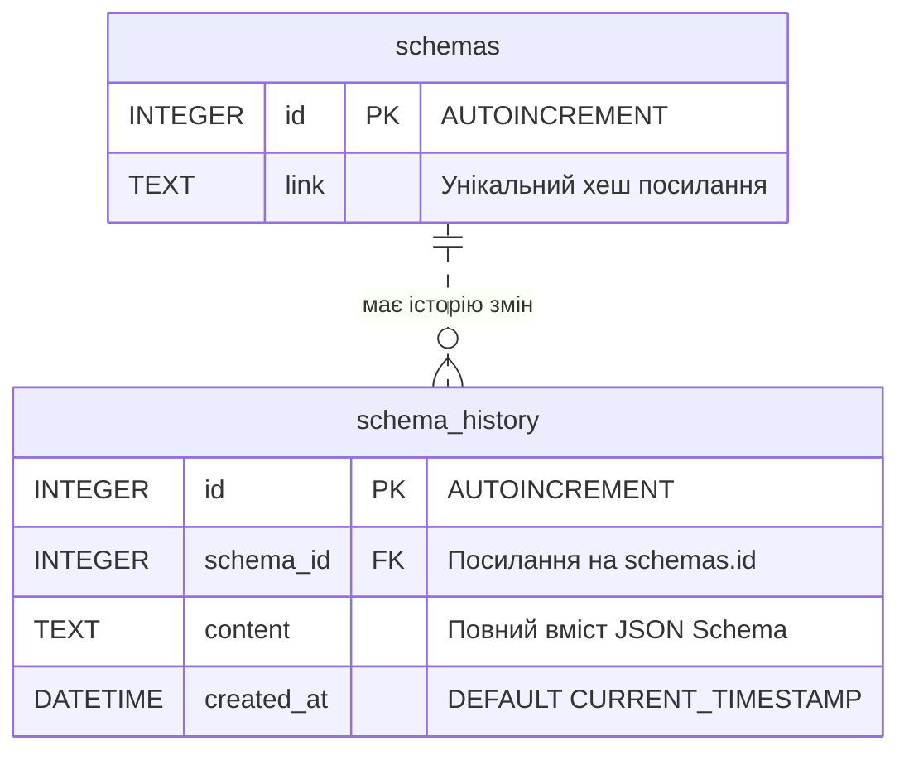

# Технічна специфікація (Spec) — JSON Tool
> [!WARNING]
> Можна було б покращити архітектуру прибравши патерни (наприклад Strategy→передача функції в аргументах іншої функції), які у свої часи розроблялись для обмежень об'єктно-орієнтованих мов як java, C# й ін. Але використаня ООП патернів є вимогою замовника.

## 1. Загальний опис проєкту

**JSON Tool** — це легкий вебінструмент для роботи з JSON Schema та валідації JSON-даних. Проєкт розробляється без системи авторизації користувачів. Доступ до збережених проектів здійснюється за допомогою унікальних публічних посилань (slug/link).

Основний фокус розробки: **мінімалізм, відсутність надлишкового коду та суворе дотримання паттернів проектування**.


## 2. Архітектура та компоненти системи

Система складається з двох основних частин: **Клієнт (Public Frontend)** та **Бекенд (Node.js Server)**.

```text
+-----------------------------------------------------------------------+
|                            КЛІЄНТ (Browser)                           |
|                                                                       |
|  +--------------------+   +---------------------+                     |
|  | CodeEditor (JSON)  |   | Visual Properties   |                     |
|  | & Syntax Highlight |   | Metadata Editor     |                     |
|  +---------+----------+   +----------+----------+                     |
|            |                         |                                |
|            +-------------------------+                                |
|                                      | (події редагування)            |
|                                      v                                |
|                        [ EditorSubject (Observer) ]                   |
|                                      |                                |
|             +------------------------+-------------------+            |
|             |                                            |            |
|             v                                            v            |
|   [ LiveValidationHandler ]                   [ AutoSaveHandler ]     |
|   (Template Method / Flyweight)               (Command Manager)       |
+----------------------------------------------+------------------------+
                                               | (HTTP API)
                                               v
+-----------------------------------------------------------------------+
|                            БЕКЕНД (Node.js)                           |
|                                                                       |
|  +--------------------+   +---------------------+   +--------------+  |
|  | Schema Routes      |   | Validation Core     |   | Export Core  |  |
|  | (/api/schemas)     |   | (Template Method)   |   | (Strategy)   |  |
|  +---------+----------+   +----------+----------+   +-------+------+  |
|            |                         |                      |         |
|            +-------------------------+----------------------+         |
|                                      |                                |
|                                      v                                |
|                        [ SQLite Database (db/schema) ]                |
+-----------------------------------------------------------------------+
```


## 3. Деталізація Паттернів Проектування

### 3.1. Strategy (Стратегія)
- **Розташування**: `/server/core/export/`
- **Призначення**: Формування експорту JSON-схеми в різні формати.
- **Класи/Інтерфейси**:
  - `ExportStrategy` (інтерфейс з методом `export(schemaObject)`).
  - `MarkdownExportStrategy` — перетворює схему у форматовану Markdown-таблицю.
  - `JsonExportStrategy` — форматує канонічний JSON рядок.
  - `ExportContext` — приймає обрану стратегію та викликає експорт.

### 3.2. Command (Команда)
- **Розташування**: `/public/js/commands.js` та `/server/core/history/`
- **Призначення**: Управління історією дій над схемою (Undo/Redo на клієнті, збереження станів у БД).
- **Класи**:
  - `Command` (інтерфейс: `execute()`, `undo()`).
  - `UpdatePropertyCommand` — зміна конкретної властивості схеми через візуальний редактор.
  - `ReplaceSchemaCommand` — повна заміна тексту схеми.
  - `CommandHistory` — стек виконаних команд для Undo/Redo.

### 3.3. Template Method (Шаблонний метод)
- **Розташування**: `/server/core/validation/BaseValidator.js`
- **Призначення**: Єдиний каркас алгоритму валідації з визначеними кроками.
- **Алгоритм**:
  1. `parseJson(rawText)` — базовий `JSON.parse` та відловлювання синтаксичних помилок.
  2. `validateRules(parsedData, schema)` — абстрактний крок, який реалізують підкласи.
  3. `formatErrors(rawErrors)` — уніфікація структури помилок для UI.
- **Реалізації**:
  - `SchemaStructureValidator` — перевіряє правила самій JSON Schema ( draft-07 / draft-2020-12 ).
  - `JsonValueValidator` — перевіряє відповідність JSON-значення заданій схемі.

### 3.4. Flyweight (Легковаговик)
- **Розташування**: `/public/js/ui/`
- **Призначення**: Спрощення розробки шляхом перевикористовування UI-компонентів (за схожим принципом до React-classes).
- **Класи**:
  - `TypeControlFlyweight` — Flyweight об'єкт: зберігає розділюваний стан для типу даних.
  - `TypeControlFactory ` — Flyweight Factory: кешує і перевикористовує єдині екземпляри controls.

### 3.5. Observer (Спостерігач)
- **Розташування**: `/public/js/observer.js`
- **Призначення**: Реактивне оновлення UI та автозбереження при редагуванні.
- **Класи**:
  - `EditorSubject` — реєструє слухачів та викликає `notify(schemaText)`.
  - `LiveValidationObserver` — запускає валідацію при зміні тексту.
  - `AutoSaveObserver` — ініціює дебаунс-збереження та запис команди в історію.
  - `FlatViewObserver` — перераховує та оновлює плоске представлення JSON.

---

## 4. Схема бази даних (SQLite)

### 4.1. Схема ER



### 4.2. Специфікація таблиць

#### Таблиця `schemas`
| Поле | Тип | Обмеження | Опис |
| :--- | :--- | :--- | :--- |
| `id` | `INTEGER` | `PRIMARY KEY AUTOINCREMENT` | Унікальний ідентифікатор теми |
| `link` | `TEXT` | `UNIQUE NOT NULL` | Унікальний хеш/slug для поширення посилання |

#### Таблиця `schema_history`
| Поле | Тип | Обмеження | Опис |
| :--- | :--- | :--- | :--- |
| `id` | `INTEGER` | `PRIMARY KEY AUTOINCREMENT` | Унікальний ідентифікатор запису історії |
| `schema_id` | `INTEGER` | `FOREIGN KEY (schemas.id) ON DELETE CASCADE` | Посилання на батьківську схему |
| `content` | `TEXT` | `NOT NULL` | Текстовий вміст JSON Schema |
| `created_at` | `DATETIME` | `DEFAULT CURRENT_TIMESTAMP` | Дата та час створення версії |

---

## 5. API Endpoints

### 5.1. Схеми та Історія
- **`POST /api/schemas`**
  - **Опис**: Створює нову схему або зберігає нову версію існуючої.
  - **Body**: `{ "link": "optional-link-hash", "content": "{\"...\"}" }`
  - **Response**: `{ "link": "abc123xyz", "historyId": 12, "updatedAt": "..." }`

- **`GET /api/schemas/:link`**
  - **Опис**: Отримує останній стан схеми за її посиланням.
  - **Response**: `{ "link": "abc123xyz", "content": "{\"...\"}" }`

- **`GET /api/schemas/:link/history`**
  - **Опис**: Отримує список усіх історичних версій схеми.
  - **Response**: `[ { "id": 1, "created_at": "..." }, ... ]`

- **`GET /api/schemas/:link/history/:historyId`**
  - **Опис**: Відновлює конкретну версію з історії.
  - **Response**: `{ "id": 12, "content": "{\"...\"}" }`

### 5.2. Експорт
- **`POST /api/export`**
  - **Опис**: Експортує надану схему в обраний формат за допомогою Strategy.
  - **Body**: `{ "content": "{\"...\"}", "format": "markdown" | "json" }`
  - **Response**: `{ "result": "| Field | Type | ... |" }`


## 6. Ключові сценарії використання (Data Flow)

### Сценарій 1: Редагування метаданих властивості через візуальний UI
1. Користувач змінює `description` поля у візуальному акордеон-списку.
2. Створюється об'єкт `UpdatePropertyCommand` і виконується.
3. Оновлюється текстовий редактор.
4. `EditorSubject` (Observer) викликає підписників.
5. `AutoSaveObserver` надсилає POST на `/api/schemas` після паузи (debounce).
6. Сервер додає запис у `schema_history`.

### Сценарій 2: Валідація JSON-даних за схемою
1. Користувач вводить JSON-значення в панель перевірки.
2. Клієнт/Сервер викликає `JsonValueValidator`, розширений від `BaseValidator` (Template Method).
3. Для кожного поля схеми запитується валідатор з `ValidatorFactory` (Flyweight).
4. Збирається уніфікований список помилок та повертається на UI.